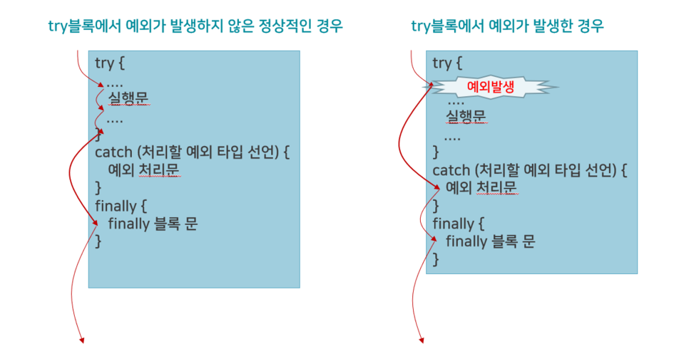
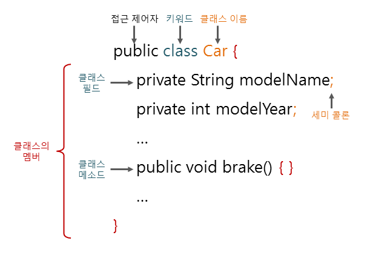
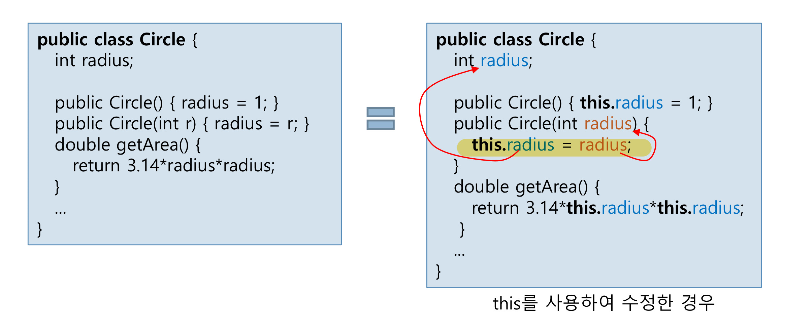
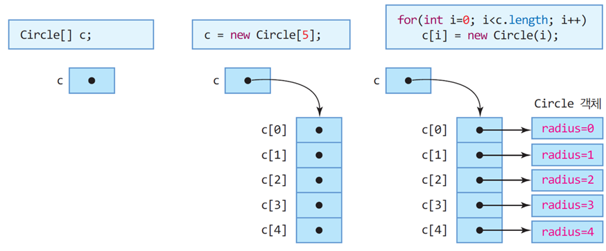

# 배열&예외처리, 클래스와 객체
## 배열
- 인덱스와 인덱스에 대응하는 데이터들로 이루어진 자료 구조
- 같은 타입의 데이터들이 순차적으로 저장되는 공간
- 배열 인덱스 0부터 시작


#### 배열 선언
```java
int intArray[]; // int : 배열 타입, intArray : 배열에 대한 레퍼런스 변수, [] : 배열 선언
char charArray[];
```

```java
int[] intArray;
char[] charArray;
```

#### 배열 생성
```java
intArray = new int[10]; //intArray : 배열에 대한 레퍼런스 변수, new : 배열 생성, int : 타입, [5] : 원소 개수
charArray = new char[20];
```

```java
int intArray[] = new int[10];
char charArray[] = new char[20];
```

#### 선언과 초기화
- 배열 생성과 값 초기화
```java
int intArray[] = {0,1,2,3,4,5,6,7,8,9};
```

- 잘못된 배열 선언
```java
int intArray[10]; //배열의 크기를 지정할 수 없음
```
#### 제일 큰 수 찾기
```java
import java.util.Scanner;
public class ArrayAccess{
    public static void main(String[] args){
        Scanner in = new Scanner(System.in);
        int intArray[] = new int[5];
        int max=0;
        
        for(int i =0; i<5;i++){
            intArray[i] = in.nextInt();
            if(intArray[i]>max)
                max=intArray[i];
        }
        System.out.print("입력된 수에서 가장 큰 수는 "+max+"입니다.");
    }
}
```

#### 배열과 for-each문
- for-each문 : 배열이나 나열의 각 원소를 순차적으로 접근하는데 유용한 for문
```java
int[] num={1,2,3,4,5};
int sum=0;
for(int k :num) // 반복될 때마다 k는 num[0], num[1],...,num[4] 값으로 설정
    sum+=k;
System.out.println("합은 "+sum);
```

```java
String names[] = {"사과","배","바나나","체리","딸기","포도"};
for(String s : names) // 반복할 때마다 s는 names[0], names[1], ..., names[5]로 설정
    System.out.print(s+" ";)
```

```java
String names[] = {"사과","배","바나나","체리","딸기","포도"};
for(String s : names) // 반복할 때마다 s는 names[0], names[1], ..., names[5]로 설정
    System.out.print(s+" ";)
```

### 2차원 배열
#### 2차원 배열 선언
```java
int intArray[][];
char charArray[][];
float floatArray[][];
```
```java
int[][] intArray;
char[][] charArray;
float[][] floatArray;
```

#### 2차원 배열 생성
```java
intArray = new int[2][5];
charArray = new char[5][5];
floatArray = new float[5][2];
```

```java
int intArray[] = new int[2][5];
char charArray[] = new char[5][5];
float floatArray[] = new float[5][2];
```

#### 2차원 배열 선언, 생성, 초기화
```java
int intArray[][] = {{0,1,2},{3,4,5},{6,7,8}};
char charArray[][] = {{'a','b','c'},{'d','e','f'}};
float floatArray[][] = {{0.01,0.02},{0.03,0.04}};
```

#### 2차원 배열의 length 필드
```java
int i[][] = new int[2][5];
int size1 = i.length; //2, 2차원 배열의 행의 개수로서 2
int size2 = i[0].length; //5, 0번째 행의 열의 개수로서 5
int size3 = i[1].length; //5
```

#### 3년간 매출 총액과 평균 구하기
```java
public class SalesRevenue{
    public static void main(String[] args){
        int intArray[][] ={{90,90,110,110}, {120,110,100,110}, {120,140,130,150}};
        
        double sum=0;
        
        for(int i=0; i<intArray.length;i++) {//intArray.length=3
            for (int j = 0; j < intArray[i].length; j++) {
                sum += intArray[i][j];
            }
        }
        System.out.println("지난 3년간 매출 총액은 "+sum+"이며 연평균 매출은"+sum/intArray.length+"입니다.");
    }
}
```

#### 메소드에서 배열 리턴
```java
int[] makeArray(){
    int temp[] = new int[4];
    return temp; //temp : 배열 리턴
        }
```

```java
public class ReturnArray{
    static int[] makeArray(){
        int temp[] = new int[4];
        for(int i=0; i<temp.length;i++)
            temp[i]=i;
        return temp;
    }
    
    public static void main(String[] args){
        int intArray[];
        intArray = makeArray();
        for(int i=0;i<intArray.length;i++){
            System.out.println(intArray[i]);
        }
    }
}
```

## 예외처리
### 예외(Exception)
- 실행 중 발생하는 에러는 컴파일러가 알 수 없음
- 자바에서 실행 중 발생하는 에러를 예외로 처리

#### try-catch-finally
```java
try{
    예외가 발생할 가능성이 있는 실행문
}catch(처리할 예외 타입 선언){
    예외 처리문
}finally{
    예외 발생 여부와 상관없이 무조건 실행되는 문장
    finally 블록은 생략 가능    
        }
```


 

```java
import java.util.Scaaner;
public class Example2{
    public static void main(String[] args) {
        Scannner sc = new Scanner(System.in);
        int divisor = 0;
        int dividend = 0;

        System.out.println("숫자 입력 : ");
        dividend=sc.nextInt();
        System.out.println("숫자 입력 : ");
        divisor=sc.nextInt();
        try{
            System.out.println("몫은"+dividend/divisor);
        }catch(ArithmeticException e){
            System.out.println("나눌 수 없습니다.");
        }
    }
}
```

## 클래스와 객체

### 객체 지향 특징
**캡슐화**
  - 객체를 캡슐로 싸서 내부를 볼 수 없게 하는 것
    - 외부의 접근으로부터 객체 보호하기 위함
**상속**
  - 상위 개체의 속성이 하위 개체에 물려짐
  - 하위 객체가 상위 개체의 속성을 모두 가지는 관계
    - 부모 클래스 : 수퍼 클래스
    - 자식(=하위) 클래스 : 서브 클래스, 수퍼 클래스를 재사용하고 새로운 특성 추가
**다형성**
    - 같은 이름의 메소드가 클래스나 개체에 따라 다르게 동작하도록 구현
      - 오버로딩 : 같은 이름이지만 다르게 작동하는 여러 메소드
      - 오버라이딩 : 슈퍼 클래스의 메소드를 서브 클래스마다 다르게 구현

### 클래스
- 객체를 만들어내기 위한 설계도 혹은 틀
- 객체의 속성과 행동 포함

### 객체(instance)
- 고유한 특성과 행동을 가짐
- 다른 객체들과 상호작용 가능
- 클래스의 모양 그대로 찍어낸 실체
- 메모리 공간을 갖는 구체적인 실체

#### 클래스 구성

 


#### 객체 생성 및 접근
- 객체 생성
  - 반드시 new 키워드를 이용하여 생성 => `new는 객체의 생성자 호출`
- 객체의 멤버 접근
  - 객체 레퍼런스.멤버

```java
public class Circle{
    int radius;
    String name;
    
    public Circle(){}
    
    public double getArea(){
        return 3.14*radius*radius;
    }
    
    public static void main(String[] args){
        Circle pizza;
        pizza = new Circle();
        pizza.radius =10;
        double area = pizza.getArea();
        System.out.println(pizza.name + "의 면적은"+area);
        
        Circle donut = new Circle();
        donut.radius=2;
        donut.name="자바도넛";
        area=donut.getArea();
        System.out.println(donut.name+"의 면적은 "+area);
    }
}
```

### 생성자
#### 생성자 특징
- 메소드
- 생성자 이름은 클래스 이름과 반드시 동일
- 생성자 여러개 작성 가능(오버로딩)
- new를 통해 객체를 생성할 때, 객체당 한 번 호출
- 생성자는 리턴타입 없음
- 객체 초기화를 위함
- 객체가 생성될 때 반드시 호출됨
  - `하나 이상의 생성자가 반드시 선언되어야 하는데, 만약 생성자를 작성하지 않았으면 컴파일러가 자동으로 기본 생성자 삽입`
  - `기본 생성자 외 파라미터가 있는 생성자가 선언되어 있으면 자동으로 기본 생성자를 삽입하지 않아 에러 발생`
  - `기본 생성자=디폴트 생성자`

```java
public class Book{
    String title;
    String author;
    
    public Book(String t){
        title=t;
        author="작가미상";
    }
    
    public Book(String t, String a){
        title =t;
        author = a;
    }

    public static void main(String[] args) {
        Book littlePrince = new Book("어린왕자","생텍쥐페리");
        Book loveStory = new Book("춘향전");
        System.out.println(littlePrince.title+" "+littlePrince.author);
        System.out.println(loveStory.title+" "+loveStory.author);
    }
}
```

#### this 레퍼런스
- 객체 자신에 대한 레퍼런스
 

#### this 필요성
- 객체의 멤버 변수와 메소드 변수의 이름이 같은 경우
- 다른 메소드 호출 시 객체 자신의 레퍼런스를 전달할 때
- 메소드가 객체 자신의 레퍼런스를 반환할 때

#### this()
- 클래스 내의 다른 생성자 호출
- 생성자 내에서만 사용 가능
- 반드시 생성자 코드의 제일 처음에 수행
```java
public class Book{
    String title;
    String author;
    void show(){System.out.println(title+" "+author);}
    
    public Book(){
        this("","");
        System.out.println("생성자 호출됨");
    }
    
    public Book(String title){
        this(title,"작자미상");
    }
    
    public Book(String title, String author){
        this.title=title;
        this.author=author;
    }
    
    public static void main(String[] args) {
        Book littlePrince = new Book("어린왕자", "생텍쥐페리");
        Book loveStroy = new Book("춘향전");
        Book emptyBook = new Book();
        loveStroy.show();
    }
    
}
```

#### 객체 배열
- 객체 배열 생성 및 사용
```java
Circle[] c;
c = new Circle[5];

for(int i=0;i<c.length;i++){
    c[i]=new Circle(i);
        }
```

```java
for(int i=0;i<c.length;i++){
    System.out.print((int)c[i].getArea()+" ");
        }
```

 

```java
class Circle{
    int radius;
    public Circle(int radius){
        this.radius=radius;
    }
    
    public double getArea(){
        return 3.13*radius*radius;
    }
}

public class CircleArray{
    public static void main(String[] args) {
        Circle [] c;
        c= new Circle[5];
        
        for(int i =0;i<c.length;i++){
            c[i] = new Circle(i);
        }
        
        for(int i=0; i<c.length;i++){
            System.out.print((int)(c[i].getArea())+" ");
        }
    }
}
```