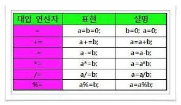

# 변수, 자료형, 연산자, 조건문, 반복문
## 변수
`변수` : 프로그램 실행 중에 값을 임시 저장하기 위한 공간  
&nbsp;&nbsp;&nbsp;&nbsp;&nbsp; ex) int song; -> int : 데이터 타입, song : 변수 이름  
`식별자` : 클래스, 변수, 상수, 메소드 등에 붙이는 이름  
**식별자 규칙**  
1. '@','#','!'와 같은 특수 문자, 공백 또는 탭은 식별자로 사용할 수 없음 But '_','$' 는 가능
2. 유니코드 문자 사용 가능. 한글 사용 가능
3. 키워드는 식별자로 사용불가 ex) int, short, import, break 등
4. 길이 제한 없음


### 데이터 타입
- 기본 타입 8개
  - 논리 타입
    - boolean : 1byte, true 또는 false
  - 문자 타입
    - char : 2bytes, Unicode
  - 정수 타입
    - byte : 1byte
    - short : 2byte
    - int : 4byte
    - long : 8byte
  - 실수 타입
    - float : 4byte
    - double : 8byte
=> 기본 데이터 타입의 크기가 정해져 있으며, CPU나 운영체제에 따라 변하지 않음  
- 문자열 리터럴
  - String : 객체  
    => 자바에서는 String은 객체여서 기본 타입이 아님
- 상수
  - final 
    - 선언 시 초기값 지정
    - 실행 중 값 변경x  
    ex) final int SONG = 10; -> final : 상수 선언, int : 데이터 타입, SONG : 상수 이름, = 10 : 초기화

```java
public class CircleArea{
    public static void main(String[] args){
        final double PI = 3.14;
        double radius = 10;
        double circleArea = 0;
        
        circleArea = radius*radius*PI;
        
        System.out.print(circleArea);
    }
}
```

### 타입 변환
- **자동 타입 변환**  
자동 타입 변환이 발생하는 경우 : 원래의 타입보다 큰 타입으로 바뀔 때  
> byte >> short/char >> int >> long >> float >> double
```java
long var;
int n 32555;
byte b = 25;
var = n;
var = b;
```

- **강제 타입 변환**  
개발자의 의도적으로 타입 변환  
-> 실수 타입이 정수 타입으로 강제 변환되면 소수점 아래가 버려짐
```java
short var;
int n = 855638017;
var = (short)n;

double d = 1.9;
int n = (int)d;
```
## 연산자
- 산술 연산자  
|산술 연산자|의미|예|결과|  
|:---:|:---:|:---:|:---:|  
|+|더하기|25.5+3.6|29.1|  
|-|빼기|3-5|-2|  
| * |곱하기|2.5*4.0|10.0|  
|/|나누기|5/2|2|  
|%|나머지|5%2|1|  


- 비트 연산자  
  


- 비교 연산자  
  


- 논리 연산자  
  


- 대입 연산자  
  

- 증감 연산자  
 


## 반복문
- for문  
  - for문 문법
  ```java
  for(초기화;조건식;증감식){
    반복문이 참일 때 반복할 문장들 ;
  }
  ```
  - for문 예제
  ```java
  public class Sample{
  public static void main(String[] args){
  int i,j;
  
  for(j=0;i<1;i<=10;i++){
  j+=i;
  System.out.print(i);
  if(i==10){
    System.out.print("=");
    System.out.print(j);
  }else{
  System.out.pring("+");
  }
  }
  }
  ```

- while문
  - while문 문법
  ```java
  while(조건식){
    반복문이 참일 때 반복할 문장들 ;
  }
  ```
  - while문 예제
  ```java
  public class Sample{
  public static void main(String[] args){
  
    Scanner rd = new Scanner(System.in);
    int = 0;
    double sum = 0;
    int i= 0;
    while((i=rd.nextInt())!=0){
        sum+=i;
        n++;
  }
    System.out.print("입력된 수의 개수는 "+n+"개이며 평균은" +sum/n+"입니다.");
  }
  }
  ```

- do-while문
  - do-while문 문법
  ```java
  do{
    반복문이 참일 때 반복할 문장들 ;
  }while(조건식);
  ```
  - do-while문 예제
  ```java
  public class Sample{
  public static void main(String[] args){
  
   char = 'a';
  
  do{
    System.out.print(a);
    a=(char)(a+1);
  }while(a<='z');
  }
  }
  ```

## 조건문
- if문
  - if문
  ```java
  if(조건식){
    조건식이 참일 때 반복할 문장들 ;
  }
  ```
  - if문 예제
  ```java
  public class Sample{
  public static void main(Stringp[] args){
  
  Scanner in = new Scanner(System.in);
  
  System.out.print("점수를 입력하시오");
  int score = in.nextInt();
  if(score>=80)
    System.out.print("축하합니다! 합격입니다!");
  }
  }
  ```
  
- if-esle문
  - if-esle문
   ```java
  if(조건식){
    조건식이 참일 때 반복할 문장들 ;
  }else{
    조건식이 참일 때 반복할 문장들 ;
  }
  ```
  
  - if-esle문 예제
  ```java
  public class Sample{
  public static void main(Stringp[] args){
  
  Scanner in = new Scanner(System.in);
  
  System.out.print("수를 입력하시오");
  int number = in.nextInt();
  if(number%3==0)
    System.out.print("3의 배수입니다.");
  }else{
   System.out.print("3의 배수가 아닙니다.");
  }
  }
  ```

- switch문
  - switch문
   ```java
   Switch(조건식){
    case 값1 : 
      조건식의 값이 값1일 때 실행할 문장들;
      break;
    case 값2 :
      조건식의 값이 값2일 때 실행할 문장들;
      break;
    default :
      조건식이 모든 값에 만족하지 않을 때 실행할 문장들
    ```

  - switch문 예제
  ```java
  public class Sample{
  public static void main(Stringp[] args){
    
  char grade = 'C';
  switch(grade){
  case'A':
  case'b':
    System.out.println("참 잘하였습니다.");
    break;
  case'C':
  case'D':
    System.out.println("좀 더 노력하세요.");
    break;
  case'F':
    System.out.println("다음 학기에 다시 수강하세요");
    break;
  default:
    System.out.println("잘못된 학점입니다.");
  }
  }
  }
  ```