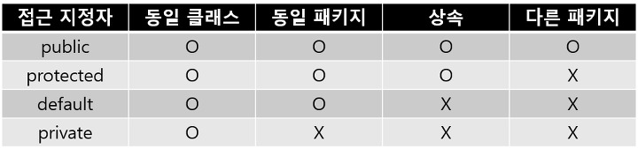

# 상속
`상속은 코드 중복을 제거하여 클래스를 간결하게 구현할 수 있게 함`
- 장점
  - 클래스의 간결화 - 멤버의 중복 작성 불필요
  - 클래스 관리 용이 - 클래스들의 계층적 분류
  - 소프트웨어의 생산성 향상 - 클래스 재사용과 확장 용이

- 특징
  - 클래스의 다중 상속을 지원하지 않음
  - 상속의 횟수에 제한을 두지 않음
  - 계층 구조의 최상위에 java.lang.Object 클래스가 있음

### 자바의 상속 선언
부모 클래스 = 슈퍼 클래스  
자식 클래스 = 서브 클래스  
`extends` 키워드를 사용해서 상속함
```java
public class Person{
    슈퍼 클래스
}

public class Student extends Person{
    서브 클래스 : Person을 상속받는 클래스 Student
}
```

```java
class Point{
    private int x,y;
    public void set(int x, int y){
        this.x=x; this.y=y;
    }
    
    public void showPoint(){
        System.out.println("("+x+","+y+")");
    }
}

class ColorPoint extends Point{
    private Strin color;
    public void setColor(String color){
        this.color=color;
    }
    
    public void showColorPoint(){
        System.out.println(color);
        showPoint();
    }
}

public class ColorPointEx{
    public static void main(String[] args){
        Point p = new Point();
        p.set(1,2);
        p.showPoint();
        
        ColorPoint cp = new ColorPoint();
        cp.set(3,4);
        cp.setColor("red");
        cp.showColorPoint();
    }
}

```

#### 상속과 protected 접근 지정자


```java
class Person{
    private int weight; //private 접근 지정. Student 클래스에서 접근 불가
    int age; //디폴트 접근 지정. Student 클래스에서 접근 가능
    protected int height; // protected 접근 지정. Student 클래스에서 접근 가능
    public String name; // public 접근 지정. Student 클래스에서 접근 가능
    
    public void setWeight(int weight){ //private 멤버인 weight를 접근하기 위한 get/set 메소드
        this.weight=weight;
    }
    
    public int getWeight(){ //private 멤버인 weight를 접근하기 위한 get/set 메소드
        return weight;
    }
}

class Student extends Person{
    public void set(){
        age = 30; // 슈퍼 클래스의 디폴트 멤버 접근 가능
        name = "홍길동"; // 슈퍼 클래스의 public 멤버 접근 가능
        height = 175; // 슈퍼 클래스의 protected 멤버 접근 가능
        //weight = 99 ; // 오류. 슈퍼 클래스의 private 멤버 접근 불가
        setWeight(99); // private 멤버 weight은 setWeight()으로 간접 접근
    }
}

public class InheritanceEx{
    public static void main(Stringp[] args){
        Student s = new Student();
        s.set();
    }
}
```

#### 상속과 생성자
> Q. 서브 클래스 객체가 생성될 때 서브 클래스의 생성자와 슈퍼 클래스의 생성자가 모두 실행되는가? 아니면 서브 클래스의 생성자만 실행되는가? 

A. 둘 다 실행된다.  
> Q. 서브 클래스의 생성자와 슈퍼 클래스의 생성자 중 누가 먼저 실행되는가?  
> 
A. 슈퍼 클래스의 생성자가 먼저 실행된 후 서브 클래스의 생성자가 실행된다. **컴파일러는 서브 클래스의 생성자에 대ㅎ, 슈퍼 클래스의 생성자를 호출한 뒤 자신의 코드를 실행하도록 컴파일 함.


- 슈퍼 클래스의 기본 생성자가 자동 선택되는 경우  
개발자의 명시적 지시가 없으면, 서브 클래스의 생성자가 기본 생성자이든 매개변수를 가진 것이든, 슈퍼 클래스에 만들어진 기본 생성자가 선택됨. 자바 컴파일러에 의해 강제로 이루어짐
  


- super()를 이용하여 명시적으로 슈퍼 클래스 생성자 선택
  - 서브 클래스의 생성자에서 super()를 이용하면, 슈퍼 클래스 생성자를 `명시적으로 선택`할 수 있음. super()는 `슈퍼 클래스 생성자를 호출`하는 코드

  - `**super()는 반드시 생성자의 첫 라인에 사용되어야 함**`

```java
class Point{
    private int x,y;
    public Point(){
        this.x=this.y =0;
    }
    public Point(int x, int y){
        this.x=x; this.y=y;
    }
    public void showPoint(){
      System.out.println("("+"x"+","+y+")");
    }
}

class ColorPoint extends Point{
    private String color;
    public ColorPoint(int x, int y, String color){
        super(x,y);
        this.color=color;
    }
    
    public void showColorPoint(){
      System.out.println(color);
      this.color=color;
    }
}

public class SuperEx{
    public static void main(String[] args){
        ColorPoint cp = new ColorPoint(5,6,"blue");
        cp.showColorPoint();
    }
}
```

## 업캐스팅과 instanceof 연산자
캐스팅 : 타입 변환


### 업캐스팅
업캐스팅 : 서브 클래스의 객체에 대한 레퍼런스를 슈퍼 클래스 타입으로 변환하는 것
```java
Person p;
Student s = new Student();
p=s; //업캐스팅
```
업캐스팅을 통해 Person 타입의 p는 Student를 객체를 가리키지만, 레퍼런스 p로는 Person 클래스의 멤버만 접근할 수 있다. 왜냐하면 p는 Person 타입이기 때문이다.

```java
class Person{
    String name;
    String id;
    
    public Person(String name){
        this.name=name;
    }
}

class Student extends Person{
    String grade;
    String department;
    
    public Student(String name){
        super(name);
    }
}

public class UpcastingEx{
  public static void main(String[] args) {
    Person p;
    Student s = new Student("이재문");
    p=s;

    System.out.println(p.name);
    
    p.grade = "A"; //컴파일 오류
    p.department = "Com"; //컴파일 오류
  }
}
```

### 다운캐스팅
다운캐스팅 : 업캐스팅과 반대로 캐스팅하는 것
`다운캐스팅은 업캐스팅과 달리 명시적으로 타입 변환 지정`

```java
public class DowncastingEx{
  public static void main(String[] args) {
    Person p = new Student("이재문"); // 업캐스팅
    Student s;
    
    s=(Student)p; //다운캐스팅

    System.out.println(s.name);//오류 없음
    s.grade="A";
  }
}
```

### instanceof 연산자 이용
> 레퍼런스 instanceof 클래스명

```java
Person jee = new Student();
Person kim = new Professor();
Person lee = new Researcher();
if (jee instanceof Person) // jee는 Person 타입으로 true
if (jee instanceof Student) // jee는 Student 타입으로 true
if (kim instanceof Student) // kim은 Student 타입이 아니므로 false
if (kim instanceof Professor) // kim은 Professor 타입이므로 true
if (kim instanceof Researcher) // Professor 객체는 Researcher 타입이기도 하므로 true
if (lee instanceof Professor) // lee는 Professor 타입이 아니므로 false
if(3 instanceof int) //문법 오류. instanceof는 객체에 대한 레퍼런스만 사용
``` 

#### 메소드 오버라이딩
