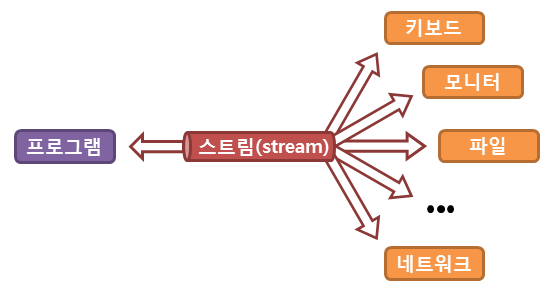

## 스트림
실제의 입력이나 출력이 표현된 데이터의 이상화된 흐름을 의미한다.
즉, 운영체제에 의해 생성되는 가상의 연결 고리를 의미하며, 중간 매개자 역할을 합니다.


### 입출력 스트림
스트림은 한 방향으로만 통신할 수 있어 입력과 출력을 동시에 처리할 수 없다.
그렇기 때문에 사용 목적에 따라 입력 스트림과 출력 스트림으로 구분된다.

|     클래스     |                 메소드                  |                       설명                       |
|:-----------:|:------------------------------------:|:----------------------------------------------:|
| inputStream |         abstract int read()          |           해당 입력 스트림으로부터 다음 바이트를 읽어드림           |
|      ^      |          int read(byte[] b)          |    해당 입력 스트림으로부터 특정 바이트를 읽어들인 후, 배열 b에 저장함.    |
|      ^      | int read(byte[] b, int off, int len) | 해당 입력 스트림으로부터 len 바이트를 읽어들인 후, 배열 b[off]부터 저장함 |
|OutputStream| abstract void write(int b) | 해당 출력 스트림에 특정 바이트를 저장함.|
|^|void write(byte[] b) | 배열 b의 특정 바이트를 배열 b의 길이만큼 해당 출력 스트림에 저장함.|
|^|void write(byte[] b, int off, int len)| 배열 b[off]부터 len 바이트를 해당 출력 스트림에 저장함.|

**스트림 API 특징**
- 외부 반복을 통해 작업하는 컬렉션과는 달리 내부 반복을 통해 작업을 수행한다.
- 재사용이 가능한 컬렉션과는 달리 단 한번만 사용할 수 있다.
- 원본 데이터를 변경하지 않는다.
- 스트림의 연산은 필터-맵 기반의 API를 사용하여 지연 연산을 통해 성능을 최적화 한다.
- parallerStream() 메서드를 통한 손쉬운 병렬 처리를 지원한다.

동작 흐름
1. 생성
2. 중개 연산(스트림의 변환)
    - 계속 연산을 추가할 수 있다.
    - Stream을 리턴한다.
    - Lazy(종료 연산이 오기 전에는 실행하지 않는다.)
    - Stateless / Stateful 오퍼레이션으로 구분할 수 있다(sorted의 경우 Stateful. 이전 데이터를 참조하기 때문)
    - filter, map, limit, skip, sorted 등
3. 최종 연산(스트림의 사용)
    - 더 이상 연산을 연결할 수 없다.
    - Stream을 리턴하지 않는다.
    - collect, allMatch, count, forEach, min, max 등

**스트림 생성**
- 컬렉션
- 배열
- 가변 매개변수
- 지정된 범위의 연속된 정수
- 특정 타입의 난수들
- 람다 표현식
- 파일
- 빈 스트림

**스트림 생성하기**
```java
    Stream<String> strStream1 = strList.stream();
    Stream<String> strStream2 = Arrays.stream(strArr);
```
- 스트림을 생성한다고 해도 clone과 같이 스트림은 데이터 소스를 변경하지 않는다.
- 스트림은 일회용이다.
- 작업을 내부 반복으로 처리한다.(작업이 간결) *내부 간결 : 반복문을 메서드 내부에 숨길 수 있다는 것

```java
for(String str : strList)
    System.out.println(str);

-> 

stream.forEach(System.out::println); //메서드 참조
stream.forEach(System.out::println(str)); //람다식
```

```java
**스트림의 중간 연산 목록**
        
- Stream<T> distinct() 									중복을 제거
- Stream<T> filter(Predicate<T> predicate) 				조건에 안 맞는 요소 제외
- Stream<T> limit(long maxSize) 						스트림의 일부를 잘라냄
- Stream<T> skip(long n) 								스트림의 일부를 건너뜀
- Stream<T> peek(Consumer<T> action) 					스트림의 요소에 작업수행
- Stream<T> sorted()									스트림의 요소를 정렬
  Stream<T> sorted(Comparator<T> comparator) 		
- Stream<R>    map(Function<T,R> mapper)				스트림의 요소를 변환
  DoubleStream mapToDouble(ToDoubleFunction<T> mapper)
  IntStream    mapToInt(ToIntFunction<T> mapper)
  LongStream   mapToLong(ToLongFunction<T> mapper)
  Stream<R>    flatmap(Function<T,Stream<R>> mapper)
  DoubleStream flatMapToDouble(Function<T,DoubleStream> m)
  IntStream    flatMapToInt(Function<T,IntStream> m)
  LongStream   flatMapToLong(Function<T,LongStream> m)
        
**스트림의 최종 연산 목록**
- void forEach(Consumer<? super T> action)//각 요소에 지정된 작업 수행
  void forEachOrdered(Consumer<? super T> action)
- long count()	//스트림의 요소의 개수 반환
- Optional<T> max(Comparator<? super T> comparator)//스트림의 최대값/최소값을 반환
  Optional<T> min(Comparator<? super T> comparator)
- Optional<T> findAny()		// 아무거나 하나 스트림의 요소 하나를 반환
  Optional<T> findFirst()	// 첫 번째 요소				
- boolean allMatch(Predicate<T> p) // 모두 만족하는지	주어진 조건을 모든 요소가 만족시키는지, 만족시키지 않는지 확인
  boolean anyMatch(Predicate<T> p) // 하나라도 만족하는지
  boolean noneMatch(Predicate<> p) // 모두 만족하지 않는지
- Object[] toArray()
  A[]      toArray(IntFunction<A[]> generator)//스트림의 모든 요소를 배열로 반환
- Optinal<T> reduce(BinaryOperator<T> accumulator)//스트림의 요소를 하나씩 줄여가면서(리듀싱) 계산
  T reduce(T identity, BinaryOperator<T> accumulator)
  U reduce(U identity, BiFunction<U,T,U> accumulator,BinaryOperator<U> combiner)
- R collect(Collector<T,A,R> collector)//스트림의 요소를 수집한다. 주로 요소를 그룹화 하거나 분할한 결과를 컬렉션에 담에 반환하는데 사용한다.

```